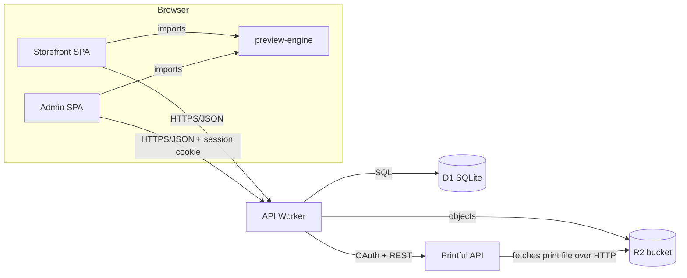

# Abbiss POD — Technical Requirements Document (TRD)

- **Document:** 2 of 6 (TRD)
- **Status:** Approved for build
- **Depends on:** 01-prd.md
- **Related:** 04-flows.md, 05-backend-schema.md, 06-implementation-plan.md

---

## 1. Architecture Overview

Three deployables plus one shared library:

- **Storefront SPA** — public React app: catalog, product detail, customizer, cart,
  checkout.
- **Admin SPA** — private React app: Printful connection, import, slot authoring,
  pricing, publish.
- **API Worker** — serverless backend: Printful proxy, persistence, admin auth,
  print-file hosting.
- **`preview-engine`** — shared TypeScript package: the single composition engine used
  by both SPAs (live preview + full-resolution print-file generation) plus the typed
  API client.



Rationale: static-first SPAs are cheap and fast; a single Worker centralizes secrets and
the Printful token so they never reach the browser; one composition engine guarantees
preview equals print (PRD Product Principle 1).

## 2. Technology Stack

| Layer | Choice |
|-------|--------|
| Language | TypeScript (strict) everywhere |
| Frontend | React 19 + Vite, two separate SPAs |
| Shared code | `preview-engine` workspace package (composition, types, API client) |
| Rendering | HTML5 Canvas 2D for compositing; CSS for editor chrome |
| Backend | Cloudflare Workers (single Worker, `fetch` handler + router) |
| Database | Cloudflare D1 (SQLite) |
| Object storage | Cloudflare R2 (product imagery, slot graphics, generated print files) |
| Fulfillment API | Printful (Catalog v2, Mockup Generator v1/v2, OAuth) |
| Build/deploy | Vite (SPAs), Wrangler (Worker + assets), npm workspaces monorepo |
| Package manager | npm workspaces |

## 3. Monorepo Layout

```
/
  apps/
    storefront/     # public React SPA (Vite) -> Cloudflare Workers assets
    admin/          # private React SPA (Vite) -> Cloudflare Workers assets
    api/            # Cloudflare Worker (router, Printful proxy, D1, R2, auth)
  packages/
    preview-engine/ # shared: composition engine, types, ApiClient
  docs/pod/         # these documents
```

- Storefront and admin are **separate SPAs** so a public bug can never expose admin
  code, and each deploys independently.
- Both depend on `preview-engine` for the editor and print-file logic.

## 4. Printful Integration

### 4.1 Auth (OAuth app model)
- The store connects via Printful **OAuth** (authorization code flow). The API Worker
  performs the code exchange and stores `access_token` + `refresh_token` + `expires_at`
  **per store** in D1.
- Tokens are refreshed **preemptively** (before expiry, with slack) and **reactively**
  (on a 401), then the call is retried once.
- The token is used only server-side. The browser never receives it.
- Although only one store exists, the per-store token row keeps a future multi-store
  migration to a matter of adding rows, not reworking auth (PRD A5).

### 4.2 Data pulled from Printful (per imported product)
| Purpose | Endpoint |
|---------|----------|
| Catalog listing / detail | `GET /v2/catalog-products`, `/v2/catalog-products/{id}` |
| Variants (size/color) | `GET /v2/catalog-products/{id}/catalog-variants` |
| Prices (owner reference) | `GET /v2/catalog-products/{id}/prices` |
| Placement template image + print area | `GET /mockup-generator/templates/{id}` |
| Print-file pixel size + DPI per placement | `GET /mockup-generator/printfiles/{id}` |
| Realistic mockup (async task) | `POST /v2/mockup-tasks`, `GET /v2/mockup-tasks?id=` |

- A **selling region** parameter (`north_america`) is sent on all catalog calls.
- Templates + printfiles together give, per placement: the flat product image, the
  print-area rectangle on it, and the exact print-file dimensions — everything the
  editor needs to draw and to generate a correct print file.
- **One-click import** (`POST /api/printful/import` with just `{ productId }`) captures
  **all placements** and **all variants** in one pass: templates/printfiles per
  placement, variants with color swatches and sizes, prices, and imagery. Where template
  images differ by color, they are stored under `variant_templates` to enable live
  garment-color switching in the editor. No manual image/URL selection.

### 4.3 Realistic mockup
- Generating a mockup is asynchronous. The Worker creates the task and **polls** until
  completion, then returns the image URLs. Polling on the server keeps the Printful task
  id out of the browser and turns an async job into a single request.
- For multi-placement products, one print file per placement is sent in a single mockup
  task, each matched to its placement's technique and mockup style.

## 5. Composition / Preview Engine

The hybrid model (PRD-approved): instant client-side composition while editing, plus an
on-demand realistic Printful mockup.

### 5.1 Live preview (client-side)
- The engine draws the design onto a Canvas at editor scale: the product's flat template
  image as background, the print area marked, and the composed artwork inside it,
  updated on every slot change (target < ~100 ms).
- Multi-placement products render one canvas per placement; the active placement is
  shown, others are switchable.

### 5.2 Print-file generation
- The **same** engine renders each placement that carries artwork at full print
  resolution (the placement's `widthPx × heightPx` at its DPI) to a PNG. This is the
  file Printful would print, guaranteeing preview == print.
- Generated PNGs are uploaded to R2 and served from a public URL, because Printful
  fetches the print file over HTTP when producing a mockup (and, later, an order).

### 5.3 Realistic mockup (on demand)
- On request, the engine produces the per-placement print files, the Worker uploads them
  to R2, creates the Printful mockup task, polls, and returns the mockup image URLs.

### 5.4 Slot rendering rules
- **Editable text:** fitted within a safe area with a minimum legible size; wraps to the
  configured max lines; over-limit input blocked at the field.
- **Color choice:** applies a chosen color to a designated element/part.
- **Graphic choice:** swaps the element's graphic for one chosen from the curated set.
- Every slot resolves to a default when unset, so the composition is always complete.

### 5.5 Authoring capabilities (owner editor)
The same engine renders the owner's rich editor; all of this composites to the identical
print file (preview == print):
- **Text styling:** font, size, color, letter spacing, outline, shadow, and arc/curve,
  rendered on canvas (curved text drawn glyph-by-glyph along the arc).
- **Uploads:** raster (PNG/JPG) and vector (SVG) drawn as `ImageElement`s; DPI/resolution
  is checked against the placement's print size and warned client-side.
- **Seamless patterns:** an element/upload tiled across the placement print area
  (`half_drop`, `block`, `brick`, `reflect`, `line_h`, `line_v`) with scale/spacing/color
  — computed client-side by repeating the component; no Printful call.
- **Background fill:** a solid color or graphic filling the placement (z = 0).
- **Layers & transforms:** move, scale, rotate, align, reorder, duplicate, and
  duplicate-to-placement operate on the element list; rotation stored per element.
- **Garment color:** switching variant swaps the base template (using `variant_templates`
  when present) and drives the realistic mockup's variant.
- **Graphics library & quick designs** are owner content persisted in D1/R2 (`assets`,
  `quick_designs`); Printful's proprietary clipart is not used.

## 6. Admin Authentication

Goal: simplest mechanism that works across devices and lets one or several operators use
**the same account** (PRD FR-A7).

- **Shared passphrase → signed session cookie.**
  - The admin passphrase is stored as a Worker **secret** (hash), never in code.
  - `POST /api/admin/login` verifies the passphrase and sets an **httpOnly, Secure,
    SameSite=Strict** cookie containing an HMAC-signed, expiring session token
    (stateless; no sessions table needed).
  - Admin API routes require a valid session cookie; invalid/expired → 401.
  - `POST /api/admin/logout` clears the cookie.
- Any device or operator logs in with the passphrase; rotation = change the secret.
- No user records, no roles, no email management. Multi-operator = shared passphrase.

## 7. API Surface (high level)

Full request/response shapes and tables are in **05-backend-schema.md**. Grouping:

| Group | Auth | Examples |
|-------|------|----------|
| Admin auth | passphrase / cookie | `POST /api/admin/login`, `POST /api/admin/logout`, `GET /api/admin/session` |
| Printful (admin) | cookie | `GET /api/printful/connect`, `/callback`, `/status`, `/catalog`, `/catalog/{id}`, `/import` |
| Products | public GET / cookie writes | `GET /api/products`, `GET /api/products/{slug}`, `PATCH /api/products/{id}` |
| Designs | public GET / cookie writes | `GET /api/designs`, `GET /api/designs/{id}`, `PUT /api/designs/{id}` |
| Mockup / print files | cookie (admin) + public (storefront preview) | `POST /api/mockup`, `PUT/GET /api/print-files/{key}` |
| Orders | public create | `POST /api/orders` (draft), `GET /api/orders` (cookie, admin) |

- **CORS:** only the storefront and admin origins are allowed; credentials enabled for
  the admin cookie.
- Public endpoints expose only published products/designs. Draft data requires the admin
  cookie.

## 8. Data Storage

- **D1 (SQLite):** `stores`, `oauth_states`, `admin_sessions` (optional if stateful),
  `products`, `designs`, `orders`, `order_items`. Full schema in 05-backend-schema.md.
- **R2 layout:**
  - `products/{productId}/photo` — imported base imagery.
  - `slot-graphics/{assetId}.svg|png` — owner-uploaded curated graphics.
  - `print-files/{key}.png` — generated print files (per design/placement, and per
    preview session).
- Printful templates/printfiles/variants captured at import are stored as JSON columns
  on `products` so the editor needs no extra Printful call at design time.

## 9. Security

- The Printful token never leaves the Worker (PRD NFR-3).
- Admin write endpoints and all draft data are gated by the session cookie.
- OAuth `state` is stored and verified on callback to prevent CSRF.
- Secrets (Printful client id/secret, admin passphrase hash, cookie signing key) are
  Worker secrets, never in the repo.
- R2 print-file URLs are the only intentionally public generated assets (Printful must
  fetch them); they contain no PII.
- No card data is handled in this release.

## 10. Deployment and Environments

- **Worker (`api`):** `wrangler deploy`, with D1 and R2 bindings and secrets.
- **SPAs:** `vite build` → served as Cloudflare Workers static assets with SPA fallback.
- **Domains (default):** `abbiss` (storefront), `abbiss-admin` (admin), `abbiss-api`
  (API) on `*.workers.dev`, replaceable with custom domains.
- **Config/vars:** `VITE_API_BASE` injected at build for each SPA; API vars for allowed
  origins, admin URL, Printful redirect URI; secrets as above.
- **Migrations:** SQL migration files applied with `wrangler d1 migrations apply`.

## 11. Performance and Caching
- Live preview is fully client-side; no network round-trip per keystroke.
- Full catalog can be fetched once and filtered client-side in the admin (Printful v2 has
  no name search); product/variant prices fetched lazily per product.
- Product photos served from R2 with cache headers so the browser reads pixels without
  cross-origin issues and without re-hitting Printful.

## 12. Observability and Error Handling
- The Worker returns structured JSON errors (`{ error }`) with appropriate status codes;
  Printful failures surface their message (truncated).
- Long/async operations (mockup polling) have explicit timeouts and clear client-side
  loading/elapsed indicators.

## 13. Non-Functional Mapping (to PRD section 12)
| NFR | Mechanism |
|-----|-----------|
| NFR-1 Performance | Client-side compositing; debounced heavy work |
| NFR-2 Fidelity | One engine for preview and print file |
| NFR-3 Security | Server-only token; cookie-gated admin |
| NFR-4 Availability | Serverless Workers + D1 + R2 |
| NFR-5 Localization | US/USD/English constants only |
| NFR-6 Accessibility | Keyboard handlers, contrast in the design system |
| NFR-7 Maintainability | English identifiers; shared engine; monorepo |

## 14. Decisions Log (locked)
1. Cloudflare Workers + D1 + R2.
2. Two separate React (Vite) SPAs + shared `preview-engine` package.
3. Admin auth = shared passphrase → HMAC-signed httpOnly session cookie.
4. Hybrid preview: client-side live composite + on-demand Printful mockup.
5. Printful OAuth **app** token model, one store, no multi-tenant logic.
6. English-only identifiers, copy, comments, and data.
