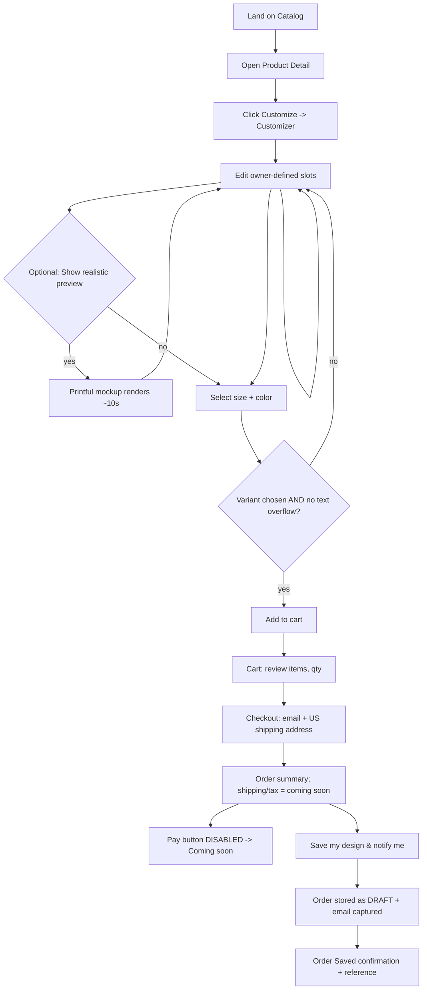
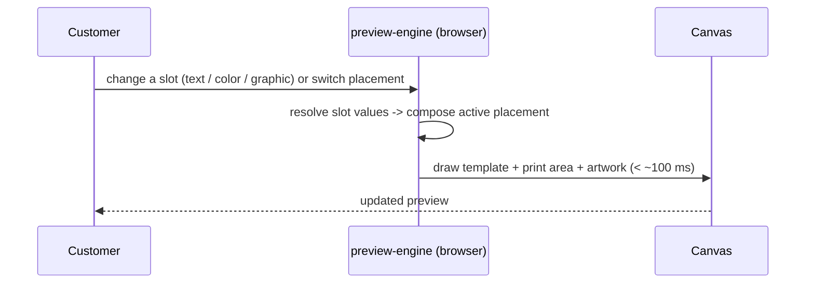
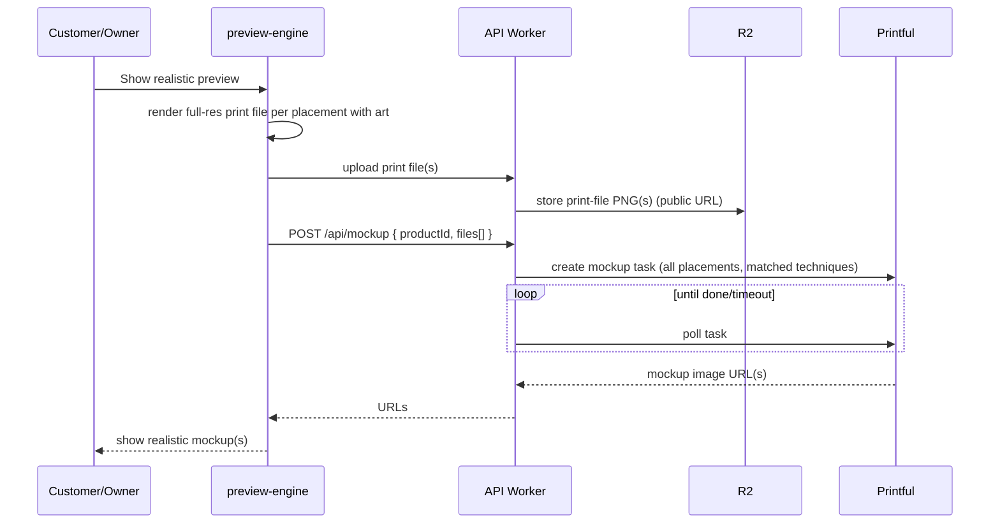
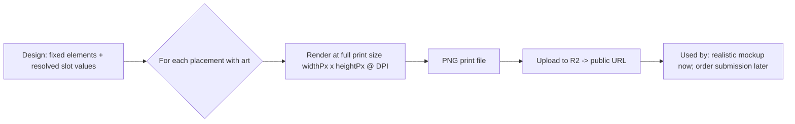
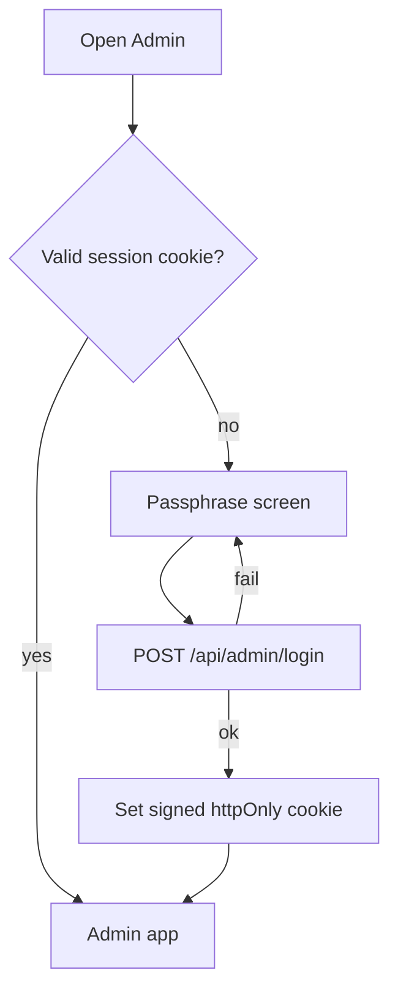
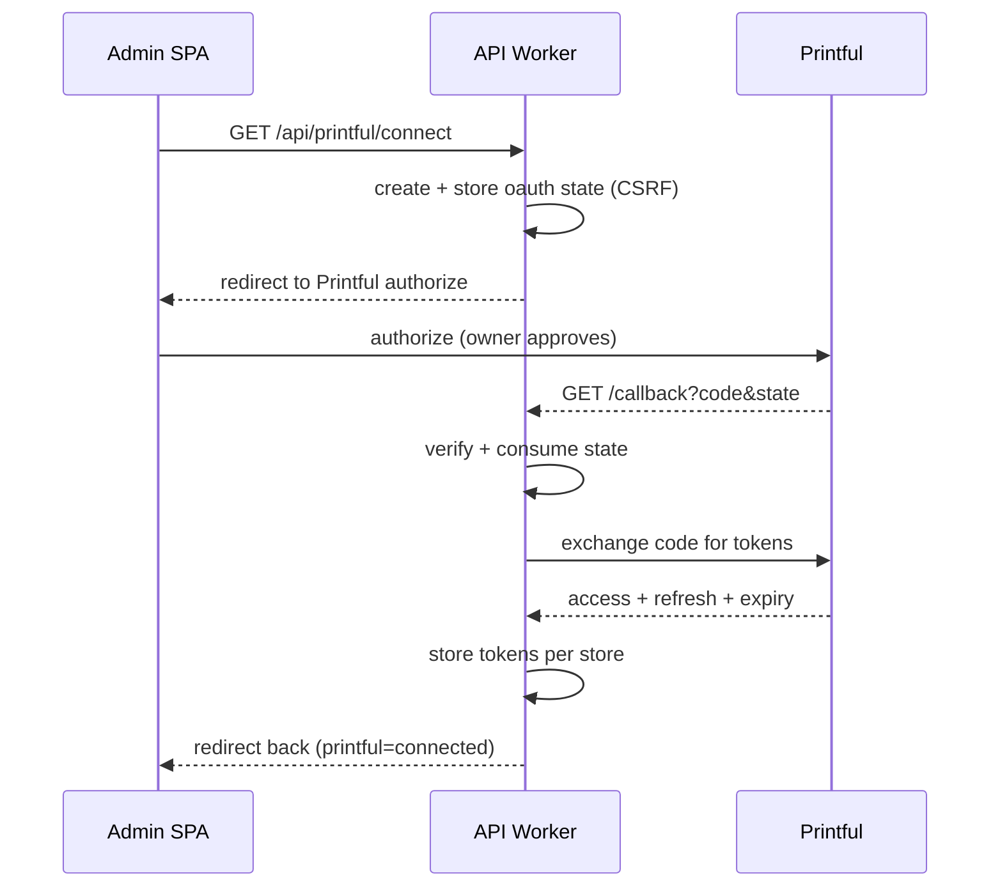
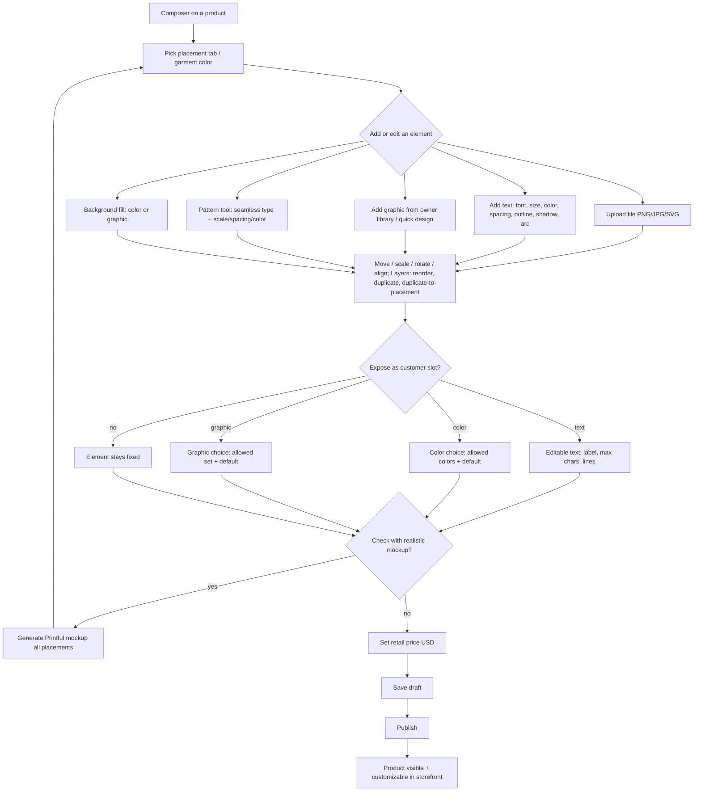
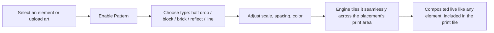
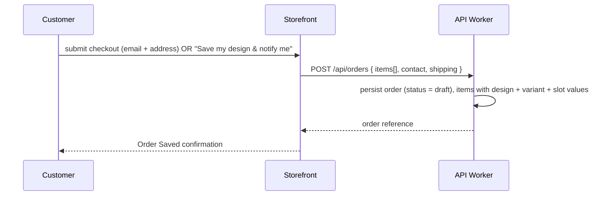

# Abbiss POD — Flows

- **Document:** 4 of 6 (Flows)
- **Status:** Approved for build
- **Depends on:** 01-prd.md, 02-trd.md, 03-ui-ux.md
- **Related:** 05-backend-schema.md

All flows reflect the locked decisions: single brand, Printful only, guest checkout,
payments and auto-fulfillment deferred ("coming soon"), curated slots, hybrid preview.

---

## 1. Customer Flow — Discover to Order Saved



Rules enforced:
- **Add to cart** is disabled until size and color are chosen and every text slot is
  within its limit.
- The instant preview updates continuously; the realistic Printful mockup is optional and
  explicitly on demand.
- No payment occurs. Reaching checkout (or using "Save my design & notify me") persists a
  **draft** order and captures the email.

## 2. Live Preview Loop (client-side)



No network call per edit. One engine renders both this preview and the print file.

## 3. Realistic Mockup (on demand, hybrid)



## 4. Print-File Generation (shared logic)



The identical composition path produces the on-screen preview and the print file
(preview == print).

## 5. Admin Flow — Login



Any device/operator with the passphrase logs in; the cookie authorizes admin API calls.

## 6. Admin Flow — Connect Printful (OAuth)



## 7. Admin Flow — One-Click Import

```mermaid
flowchart TD
  A[Browse Printful catalog] --> B[Click Import & Design on a product]
  B --> C[POST /api/printful/import { productId }]
  C --> D[API fetches product, ALL variants, prices, templates + printfiles for ALL placements]
  D --> E[Store base imagery in R2]
  E --> F[Persist product: placements w/ printSpec, all variants w/ swatches, price ref]
  F --> G[Create empty design for the product]
  G --> H[Redirect straight into the Composer on this product as DRAFT]
```

No manual image/URL picking and no per-variant repetition: one action imports the whole
product and opens the editor.

## 8. Admin Flow — Author Design (Design Maker), Expose Slots, Publish



Unpublish reverses step H (product hidden from storefront, data retained).

## 8b. Pattern Tool (all-over)



## 9. Draft Order Creation (checkout, no payment)



No Printful order is created; no charge occurs.

## 10. State Machines

### 10.1 Product status
```
draft --publish--> published --unpublish--> draft
```
- `draft`: importable/editable, not shown in storefront.
- `published`: shown and customizable in storefront.

### 10.2 Order status (MVP + reserved future)
```
draft ──(payments live, future)──> pending_payment ──paid──> submitted ──> fulfilled
                                                     └──failed
```
- **MVP:** orders never leave `draft`. The states after `draft` are reserved for the
  payments + auto-fulfillment release and are not implemented now.

## 11. Error & Edge Handling (flow-level)
- **Printful disconnected** (admin): import/mockup return a clear "Printful not connected"
  and prompt to connect.
- **Token expired:** transparent refresh + one retry; only a persistent failure surfaces
  "reconnect Printful".
- **Mockup timeout:** stop polling, show a retry hint; the instant preview remains valid.
- **Text overflow:** blocked at the field; Add to cart stays disabled with the reason.
- **Missing variant:** Add to cart disabled with the reason.
- **Product with no template:** cannot be imported for customization; excluded in the
  import UI.
- **Empty states:** catalog, cart, layers, and mockup panels each show defined copy.
